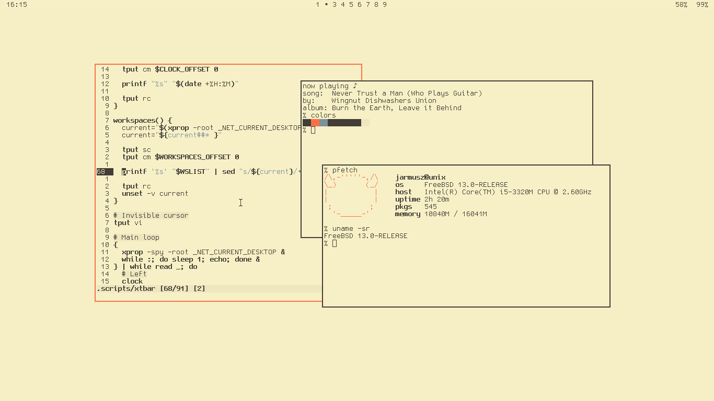

-----------------------
	* OS:     FreeBSD
	* WM:     CWM 
	* Bar:    XTerm (cwm/xtbar)
	* Sh:     Bash
	* Term:   XTerm
	* Editor: NVim
	* Font:   Gohu (CWM), Hack (StumpWM)
-----------------------

Most of my CWM configs are placed into the source code directly. I
don't really use stumpwm now, I keep it here just so people may
get example config.

Unless stated otherwise, every file in this repository is under Creative Commons 0 licence.
