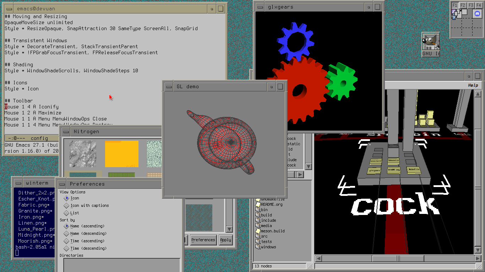

-----------------------
	* OS:     Devuan
	* WM:     FVWM 
	* Sh:     Bash
	* Term:   XTerm
	* Editor: Emacs
	* Font:   Terminus (TTF)
-----------------------

Most of my CWM configs are placed into the source code directly. I
don't really use stumpwm now, I keep it here just so people may
get example config.

Unless stated otherwise, every file in this repository is under Creative Commons 0 licence.
